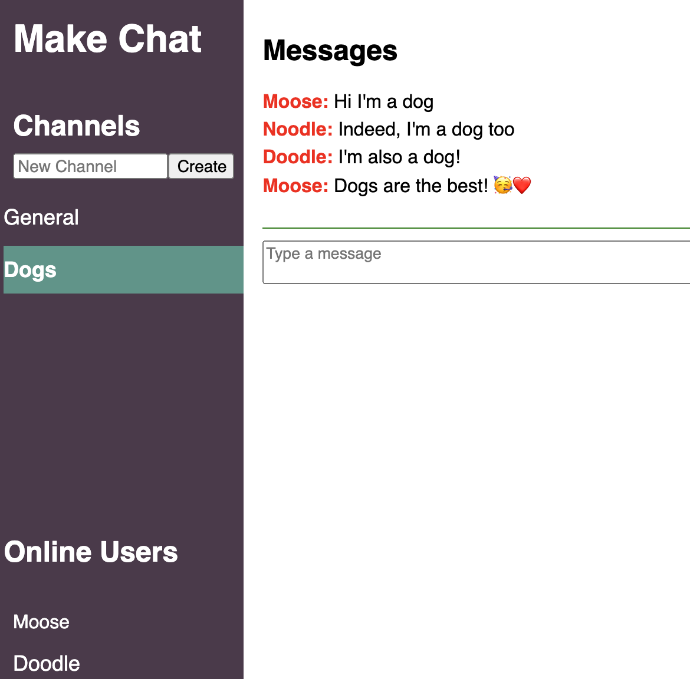

A live messaging app similar to Slack or Discord (but much more basic) implemented using JavaScript.

The tech stack includes Express.js for the backend server, Socket.io for real-time communication between the server and clients, and HTML with some JavaScript and jQuery for the frontend.

The app allows users to create a user, join chat channels, send messages, and see a list of online users. Channels and messages are stored in memory on the server.

